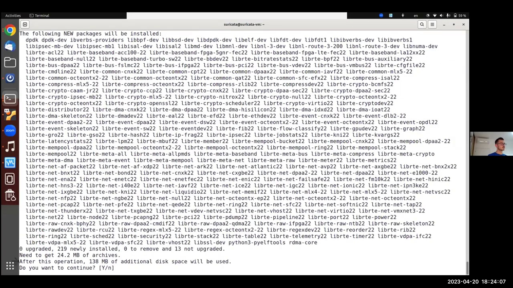

Welcome to the Suricata Webinar on PDK Support
----------------------------------------------

In this insightful webinar hosted by Julianna Fajardini, we delve into the world of Suricata and its latest advancements with a focus on PDK support. Lucas Smith, a core team member of the Open Information Security Foundation (OISF) and a notable contributor to Suricata 7's DPDK support, leads the presentation. This session is designed for enthusiasts from around the globe, regardless of the time zone.

Introduction to Suricata and OISF
---------------------------------

Suricata is a forefront open-source security technology, backed by the Open Information Security Foundation (OISF). OISF is a US-based nonprofit organization committed to ensuring Suricata's excellence and accessibility. The foundation is a collective of security experts, programmers, and industry leaders dedicated to the advancement of open-source security technologies.

[Jump to this part of the video: 00:00:50](https://www.youtube.com/watch?v=KX1QOqMtchg&t=50s)

Lucas Smith: Spearheading Suricata's DPDK Support
--------------------------------------------------

Lucas Smith, a PhD student and researcher with a keen interest in enhancing Suricata's performance, introduces the concept of DPDK (Data Plane Development Kit) support in Suricata 7. His work focuses on leveraging both hardware-assisted and software-based means to accelerate Suricata's capabilities, promising significant advancements in performance and efficiency.

Interactive Q&A Session
------------------------

The webinar encourages active participation through a dedicated Q&A channel. Attendees are invited to submit their questions, ensuring a comprehensive understanding of the presented topics. This interactive session aims to address all inquiries by the webinar's conclusion, fostering an engaging and informative experience.

[Jump to this part of the video: 00:03:01](https://www.youtube.com/watch?v=KX1QOqMtchg&t=181s)

Suricata and DPDK Integration Overview
======================================

Welcome to our detailed exploration of integrating Suricata with DPDK. This guide is designed to provide you with all the necessary information to get Suricata running with DPDK, even if you're new to DPDK. Lucas Csismic, a Suricata team member and PhD student, leads this webinar.

Introduction to DPDK
--------------------

DPDK stands for Data Plane Development Kit, an optimized set of open-source libraries aimed at accelerating packet processing workloads. Governed by the Linux Foundation, DPDK is supported by major contributors like Intel, NVIDIA, and Marvel, among others.

[Jump to this part of the video: 00:09:08](https://www.youtube.com/watch?v=KX1QOqMtchg&t=548s)

Why Choose DPDK for Suricata?
-----------------------------

Choosing DPDK with Suricata can significantly enhance packet processing performance, potentially adding up to 20% or more, depending on your setup. DPDK's kernel bypass and polling mechanisms are key to this performance boost, especially in IDS and IPS modes where latency reduction is also a benefit.

[Jump to this part of the video: 00:10:40](https://www.youtube.com/watch?v=KX1QOqMtchg&t=640s)

Understanding Suricata's Architecture
-------------------------------------

Suricata processes traffic through multiple threads, including management and packet processing threads, known as workers. These workers handle everything from capturing to decoding, detection, and outputting traffic data. The capture module, crucial for receiving traffic, can vary, with DPDK being a high-performance option.

Comparing Capture Modules: AF Packet vs. DPDK
---------------------------------------------

The primary difference between AF packet and DPDK lies in how packets are received. AF packet involves kernel space, where packets go through several steps, including interrupts, before reaching the application. DPDK, on the other hand, bypasses the kernel, directly polling packets from the NIC, leading to improved performance but higher CPU usage.

Demo: Setting Up Suricata with DPDK
-----------------------------------

Two demos are prepared to showcase DPDK's setup with Suricata: one on a virtual machine running Ubuntu 22.04 server with virtual NICs, and another on a physical machine connected to a live network. These demos aim to demonstrate DPDK's versatility across different environments and provide tips for optimal configuration.

[Jump to this part of the video: 00:16:59](https://www.youtube.com/watch?v=KX1QOqMtchg&t=1019s)

By understanding the benefits and setup process of integrating DPDK with Suricata, users can significantly enhance their network monitoring and security solutions' performance and efficiency.

## Setting Up Ubuntu for Serikata Compilation
---

### Introduction to the Compilation Process

In this section, we dive into the initial steps required to compile Serikata on an Ubuntu virtual machine. This process is crucial for those who have not yet compiled Serikata and includes the installation of necessary dependencies and packages.

### Installing Dependencies for Serikata

The first step involves updating and upgrading the system to ensure all the required dependencies for Serikata can be installed smoothly. This includes the installation of DPDK and its development packages, which are essential for Serikata's operation.

[Jump to this part of the video: 00:20:26](https://www.youtube.com/watch?v=KX1QOqMtchg&t=1226s)

### Verifying DPDK Installation

After installing DPDK, it's important to verify the installation using PackageConfig. This step confirms that DPDK version 21.11.11 is correctly installed on the system, ensuring compatibility with Serikata.

## Preparing the Environment for Serikata
---

### Installing Additional Tools

Before compiling Serikata, additional tools such as CPygen need to be installed using cargo. This step is crucial for ensuring that all necessary binaries are available in the environment.

[Jump to this part of the video: 00:21:27](https://www.youtube.com/watch?v=KX1QOqMtchg&t=1287s)

### Cloning the Serikata Repository

To proceed with the compilation, the official Serikata repository must be cloned. This step is essential for accessing the latest version of Serikata and its dependencies.

### Initializing the Working Environment

After cloning the repository, the next step involves bundling all dependencies, including the libhtp library, and initializing the working environment with autogen. This prepares the system for the compilation process.

[Jump to this part of the video: 00:24:55](https://www.youtube.com/watch?v=KX1QOqMtchg&t=1495s)

## Configuring and Compiling Serikata
---

### Configuring the Build

The configuration script is a critical step in the compilation process. It allows for the inclusion of DPDK in the build, which is essential for Serikata's operation. This minimal configuration is necessary for a successful compilation.

### Compilation and Verification

Once configured, the compilation process can begin. It's important to verify that Serikata's configuration includes support for both air packet and DPDK, ensuring that the compilation is successful and Serikata is ready for use.

[Jump to this part of the video: 00:26:25](https://www.youtube.com/watch?v=KX1QOqMtchg&t=1585s)

## Verifying DPDK Installation and Configuration
---

### Exploring DPDK Applications

After compiling Serikata, it's beneficial to verify the DPDK installation further by exploring essential DPDK applications. This includes applications for working with network interface cards, allocating memory pages, and testing DPDK's functionality.

### Binding Network Devices to DPDK

For DPDK to work with network devices, it's necessary to bind a compatible driver to the virtual interface. This process involves using the dpdk devbind tool to bind the vfio-pcie driver, allowing DPDK to interact with the network device.

[Jump to this part of the video: 00:29:59](https://www.youtube.com/watch?v=KX1QOqMtchg&t=1799s)

### Allocating Huge Pages for DPDK

DPDK uses huge pages to store data in larger memory chunks, improving efficiency. Allocating huge pages is a crucial step in preparing the system for DPDK's operation, ensuring that sufficient memory is available for data processing.

### Testing DPDK Functionality

Finally, testing DPDK's functionality with the testpmd command is essential for verifying that the installation and configuration have been successful. This step confirms that DPDK is ready for use with Serikata, ensuring optimal performance.

[Jump to this part of the video: 00:32:36](https://www.youtube.com/watch?v=KX1QOqMtchg&t=1956s)

Setting Up Suricata with DPDK
-----------------------------

In this section, we delve into the process of setting up Suricata, a high-performance Network IDS, IPS, and Network Security Monitoring engine, with DPDK (Data Plane Development Kit) to enhance packet processing capabilities. The focus is on configuring Suricata to utilize DPDK for handling network packets efficiently.

### Initial Steps and Configuration

The journey begins with ensuring that Suricata has compiled successfully, indicating readiness for configuration and execution. The configuration process involves utilizing a specific YAML file, `Suricata.yaml`, tailored for DPDK integration.

#### DPDK Environment Abstraction Layer Parameters

Within the `Suricata.yaml` file, the DPDK section is crucial. It contains parameters for the Environment Abstraction Layer (EAL), which are essential for DPDK's operation. These parameters include the cross-type and the ability to isolate specific NICs (Network Interface Cards) for Suricata's use, enhancing performance and security.

[Jump to this part of the video: 00:35:14](https://www.youtube.com/watch?v=KX1QOqMtchg&t=2114s)

### Configuring Network Interfaces

The configuration file also addresses the setup of network interfaces that Suricata will monitor. This includes specifying the PCI address of the interfaces, ensuring that Suricata can correctly identify and utilize the intended NICs for packet processing.

[Jump to this part of the video: 00:35:53](https://www.youtube.com/watch?v=KX1QOqMtchg&t=2153s)

### Testing with the TestPMD Application

Before integrating with Suricata, the functionality of the NICs and their configuration is verified using the TestPMD application. This application is a straightforward tool for testing the behavior of NICs, primarily by forwarding packets between interfaces. This step confirms that the DPDK setup is correctly handling packets at a basic level.

[Jump to this part of the video: 00:36:41](https://www.youtube.com/watch?v=KX1QOqMtchg&t=2201s)

### Finalizing Suricata Configuration

The final steps involve fine-tuning Suricata's configuration for optimal performance with DPDK. This includes specifying the number of threads Suricata should use and setting CPU affinity to distribute processing load across multiple CPU cores effectively. These adjustments are crucial for leveraging the full capabilities of DPDK within Suricata.

[Jump to this part of the video: 00:37:05](https://www.youtube.com/watch?v=KX1QOqMtchg&t=2225s)

### Launching Suricata

With the configuration complete, Suricata is ready to be launched with DPDK support. The command line includes specifying the configuration file, verbosity level, and log directory, among other options. This step marks the beginning of Suricata's enhanced network monitoring capabilities powered by DPDK.

[Jump to this part of the video: 00:38:05](https://www.youtube.com/watch?v=KX1QOqMtchg&t=2285s)

### Troubleshooting

Even with careful setup, issues may arise, such as missing parameters or incorrect configurations. Addressing these promptly ensures that Suricata and DPDK work in harmony for advanced network security monitoring.

[Jump to this part of the video: 00:38:33](https://www.youtube.com/watch?v=KX1QOqMtchg&t=2313s)

### Understanding Virtual and Physical Environments for Suricata Deployment
---

Deploying Suricata in different environments comes with its unique challenges and configurations. This section delves into the nuances of setting up Suricata in virtual environments versus physical machines, highlighting the limitations and steps for successful deployment.

#### Virtual Environment Limitations
---

In virtual environments, the setup process for Suricata involves specific considerations, particularly regarding the number of workers that can be set. Due to limitations with network adapters in virtual settings, it's often necessary to restrict the system to a single worker.

[Jump to this part of the video: 01:12:33](https://www.youtube.com/watch?v=KX1QOqMtchg&t=4353s)

#### Transitioning to Physical Machine: Oracle Linux Server Setup
---

Switching focus to a physical machine setup, the guide walks through the initial steps on an Oracle Linux Server 8.7. This part of the process includes preparing the system for Suricata by compiling necessary components, such as DPDK, using Mism and Ninja tools.

#### Compiling DPDK with Mism and Ninja
---

The compilation of DPDK is crucial for Suricata's performance on physical machines. This section provides a detailed walkthrough of installing Mism and Ninja, setting up the build directory, and ensuring that the necessary drivers, including Mellanox or NVIDIA NIC drivers, are enabled and compiled correctly.

[Jump to this part of the video: 00:41:13](https://www.youtube.com/watch?v=KX1QOqMtchg&t=2473s)

#### Suricata Installation and Dependency Management on Oracle Linux
---

After setting up the physical machine and ensuring DPDK is compiled with the required drivers, the focus shifts to installing Suricata. This involves cloning the Suricata repository, installing essential dependencies, and configuring the build to include hyperscan for enhanced detection capabilities.

[Jump to this part of the video: 00:44:58](https://www.youtube.com/watch?v=KX1QOqMtchg&t=2698s)

This comprehensive guide provides step-by-step instructions for deploying Suricata in both virtual and physical environments, addressing common challenges and offering solutions to ensure a smooth setup process.

## BPDK Compilation and Hyperscan Installation on Ninja

In this section, we delve into the process of compiling BPDK and installing Hyperscan on a system named Ninja. This process mirrors the steps taken on Ubuntu, emphasizing the installation of `cbindgen` using cargo. For those who have previously set the path to `cbindgen`, repeating this step is unnecessary.

- **Key Steps:**
  - Compilation and installation of BPDK.
  - Installation of `cbindgen` with cargo.
  - Verification of BPDK installation via package config command, confirming version 22.11.

## Configuring and Compiling Srikala with BPDK Support

Following the successful installation of BPDK, the focus shifts to configuring and compiling Srikala, a process that includes enabling BPDK support and integrating Hyperscan for enhanced performance.

- **Configuration Highlights:**
  - Execution of `bundle out of gen` and configuration of Srikala.
  - Utilization of the `make` command for compilation, deliberately skipping installation to save time.
  - Confirmation of `afp-enabled BPDK support` and Hyperscan integration.

[Jump to this part of the video: 00:48:55](https://www.youtube.com/watch?v=KX1QOqMtchg&t=2935s)

## Exploring BPDK with Network Devices

An exploration into running BPDK reveals insights into network devices and driver compatibility, particularly focusing on Intel and Mellanox (NVIDIA) cards. This section highlights the differences in driver requirements and the process of rebinding network devices to compatible drivers.

- **Driver Compatibility and Binding:**
  - Identification of network devices using kernel drivers, including Intel x710 with E4PE driver and Mellanox (NVIDIA) card with MLX5 driver.
  - Discussion on Mellanox (NVIDIA) bifurcated drivers that support both kernel and BPDK without the need for rebinding.
  - For Intel drivers, the necessity of rebinding to either VFIO or UILBCI generic drivers, with a preference for VFIO when available.

## VFIO Binding and Mellanox Card Demonstration

The guide concludes with an attempt to rebind an Intel network device to the VFIO driver, encountering an error that leads to a fallback on UILBCI generic drivers. Additionally, it touches on the `unsafe MMIO` directive for VFIO and opts to demonstrate using a Mellanox card for practical purposes.

- **VFIO Binding Attempt:**
  - Attempt to bind an Intel network device to VFIO, encountering an error.
  - Explanation of the `unsafe MMIO` directive for VFIO and the fallback to UILBCI generic drivers when VFIO is not available.

[Jump to this part of the video: 00:51:43](https://www.youtube.com/watch?v=KX1QOqMtchg&t=3103s)

Configuring Suricata with YAML and Understanding CPU Affinity
-------------------------------------------------------------

In this section, we delve into the process of editing the `Serika.yaml` file to optimize Suricata's performance by adjusting worker threads and understanding the importance of CPU affinity in a multi-CPU system environment.

### Editing the Serika.yaml File

The initial step involves setting up the `Serika.yaml` file, where we adjust the number of workers and leave the default settings unchanged. This configuration is crucial for the efficient operation of Suricata.

### Allocating Huge Pages

Before running Suricata, it's essential to ensure that huge pages are allocated, a step that might be overlooked but is critical for performance.

[Jump to this part of the video: 00:53:24](https://www.youtube.com/watch?v=KX1QOqMtchg&t=3204s)

### Monitoring Packet Capture and Performance

After running Suricata, monitoring tools reveal that packets are being received, but there's an indication of packet loss. This leads to the discovery that only the first CPU core is active, highlighting the need for setting CPU affinity.

Understanding CPU Affinity and NUMA Nodes
----------------------------------------

CPU affinity plays a pivotal role in optimizing the performance of network applications like Suricata. This section explains the concept of CPU affinity, NUMA nodes, and their significance in a multi-CPU system.

### The Importance of CPU Affinity

Setting CPU affinity ensures that Suricata runs on multiple cores, addressing the issue of inactive cores and uneven workload distribution.

[Jump to this part of the video: 00:54:40](https://www.youtube.com/watch?v=KX1QOqMtchg&t=3280s)

### NUMA Nodes and Memory Access

NUMA nodes are crucial for understanding how memory access works in multi-CPU systems. Ensuring that processes run on the same NUMA node as their memory and NIC (Network Interface Card) can significantly enhance performance.

### Configuring Suricata for Optimal Performance

The configuration involves setting Suricata to run on even-numbered cores of CPU socket zero, based on the NUMA node architecture. This setup aims to optimize memory access rates and throughput.

[Jump to this part of the video: 00:57:00](https://www.youtube.com/watch?v=KX1QOqMtchg&t=3420s)

Adjusting Suricata and DPDK Settings for Enhanced Performance
-------------------------------------------------------------

To handle traffic efficiently, Suricata's settings require fine-tuning. This section covers the adjustments made to Suricata's configuration and the rationale behind these changes.

### Fine-Tuning Suricata Settings

Adjustments include enabling statistics logging, increasing the flow table size, and optimizing memory allocation for various engines within Suricata. These changes aim to improve Suricata's ability to process and analyze network traffic effectively.

[Jump to this part of the video: 01:00:23](https://www.youtube.com/watch?v=KX1QOqMtchg&t=3623s)

### Understanding DPDK Settings and Their Impact

DPDK (Data Plane Development Kit) settings are crucial for Suricata's performance. By intentionally setting DPDK to lower settings, we can illustrate potential bottlenecks and error counters that may arise, emphasizing the importance of appropriate configuration.

[Jump to this part of the video: 01:02:04](https://www.youtube.com/watch?v=KX1QOqMtchg&t=3724s)

This comprehensive guide has walked you through the steps of configuring Suricata, understanding CPU affinity and NUMA nodes, and adjusting settings for optimal performance. By following these guidelines, you can ensure that Suricata runs efficiently in a multi-CPU system environment, effectively handling network traffic and enhancing security monitoring capabilities.

Troubleshooting Packet Processing Errors in Network Security Tools
===================================================================

Understanding Error Counters: I Missed and No Embufs
----------------------------------------------------

In network security monitoring, encountering error counters such as "I missed" and "no embufs" can indicate issues in packet processing. The "no embufs" error signifies a lack of available packet representation objects for the network card to use, leading to packet drops. On the other hand, the "I missed" error points to an overloaded network interface card that cannot process incoming packets efficiently.

Fixing the "No Embufs" Error by Adjusting Mempool Size
-------------------------------------------------------

A practical solution to the "no embufs" error involves increasing the mempool size, which is the memory pool available for packet processing. Adjusting the mempool size ensures that there are sufficient objects for the network card to allocate incoming packets to. This adjustment is crucial for maintaining efficient packet processing and avoiding drops due to a lack of resources.

[Jump to this part of the video: 01:04:06](https://www.youtube.com/watch?v=KX1QOqMtchg&t=3846s)

Optimizing Mempool Cache Size for Core Efficiency
-------------------------------------------------

Enhancing the mempool cache size is another step towards optimizing packet processing. The mempool cache acts as a buffer for each processing core, requiring a calculation based on the number of cores and the desired cache size. Ensuring an adequate mempool cache size is essential for supporting the receive and transmit descriptors, ultimately contributing to a more efficient packet processing setup.

Evaluating the Impact of Configuration Adjustments
--------------------------------------------------

After making adjustments to the mempool size and cache settings, monitoring the system's statistics is crucial to assess the effectiveness of these changes. A successful configuration will show a reduction or elimination of the "no embufs" error counters, indicating an improved capacity for packet processing. Further adjustments can be made to optimize the system's performance and reduce packet drop rates.

[Jump to this part of the video: 01:05:37](https://www.youtube.com/watch?v=KX1QOqMtchg&t=3937s)

Understanding Drop Rates and Misleading Statistics
--------------------------------------------------

When evaluating the performance of network security tools like Suricata, it's important to focus on relevant statistics and not be misled by apparent increases in drop rates. Drops can occur for various reasons, including temporary discrepancies during tool shutdowns. A comprehensive understanding of the system's statistics is essential for accurately assessing its performance and identifying areas for improvement.

Optimizing Mempool Settings for Enhanced Performance
-----------------------------------------------------

In the quest to optimize network performance, adjusting the mempool size plays a crucial role. An example discussed involves increasing the mempool to 16K while maintaining the mempool page at its default, given that 511 or 512 is typically the maximum number you can set for your mempool cache size without alterations during build time.

[Jump to this part of the video: 01:07:08](https://www.youtube.com/watch?v=KX1QOqMtchg&t=4028s)

Understanding Missed Packets and Network Uptime
-----------------------------------------------

Missed packets are a common occurrence during the initial stages of starting your device and network interface card (NIC), especially when the packet sniffer (in this case, Serikata) has not yet begun receiving packets. Despite an increase in uptime, the number of missed packets may remain constant, indicating a stable configuration under the current PDK settings.

General Tuning Tips for Network Optimization
--------------------------------------------

The process of tuning your network involves experimenting with various mempool and descriptor settings. While larger mempool sizes and more descriptors can lead to cache misses, they may also provide a necessary buffer for handling network traffic efficiently.

[Jump to this part of the video: 01:08:45](https://www.youtube.com/watch?v=KX1QOqMtchg&t=4125s)

Analyzing Extended Statistics for In-depth Insights
----------------------------------------------------

Enabling verbose logging allows for a detailed analysis of network performance upon shutting down the packet sniffer. This includes statistics on the number of packets received directly by the NIC, distribution across individual queues, and types of packets (unicast, multicast, broadcast). Additionally, "out of buffer" errors highlight instances where the NIC is overwhelmed and unable to process further traffic.

Wrapping Up and Addressing Frequently Asked Questions
-----------------------------------------------------

As the discussion extends beyond the allocated time, a quick overview of frequently asked questions is suggested. This segment aims to highlight important points and clarify any outstanding queries related to network optimization and configuration.

[Jump to this part of the video: 01:10:14](https://www.youtube.com/watch?v=KX1QOqMtchg&t=4214s)

### Frequently Asked Questions on DPDK and Srigata in Cloud Environments

#### Overview of DPDK Srigata in Cloud Services

One of the questions raised by Michael Salka Singh inquired about the experience of running DPDK Srigata in cloud environments like Azure and AWS, which both support DPDK. The response highlighted that while direct testing in these cloud services hasn't been conducted, DPDK Srigata has been tested with virtual interfaces and should work in virtualized environments. However, limitations exist, such as in VirtualBox, where only one Srigata worker can be enabled.

[Jump to this part of the video: 01:11:58](https://www.youtube.com/watch?v=KX1QOqMtchg&t=4318s)

#### Limitations and Contributions

The discussion also touched on the limitations of using DPDK in virtualized environments and invited contributions from the community. Specifically, it was noted that DPDK requires supported NICs, and not all hardware, especially older or desktop network cards, may be compatible. This limitation applies to both virtual and physical environments.

#### Leveraging Intel DPDK for Performance Gains

Vinay Reddy's question regarding the cost-benefit analysis of leveraging Intel DPDK for a performance gain of 10 to 20% was addressed. The response suggested that the decision depends on the scale of deployment and the existing performance. For multiple deployments, DPDK could be beneficial in extending hardware utility and enhancing performance. However, for a single deployment running satisfactorily, the effort may not be justified. The ease of setting up DPDK was also highlighted, suggesting that experimenting with DPDK on one's setup could be worthwhile.

[Jump to this part of the video: 01:14:17](https://www.youtube.com/watch?v=KX1QOqMtchg&t=4457s)

#### Conclusion

The session concluded with an emphasis on the potential benefits of DPDK in specific scenarios and the importance of community contributions to overcome limitations in cloud and virtualized environments. The availability of slides for further reference was also mentioned, ensuring attendees could access the detailed information shared during the presentation.

Exploring Virtual Environments and Network Interfaces
-----------------------------------------------------

In a recent discussion, a question was raised about the type of virtual network interface controller (NIC) used in a specific setup, particularly whether it was virtio or involved SR-IOV technology. The response clarified that virtio was indeed the choice, highlighting its compatibility and performance within virtual environments.

- **Virtual NIC Utilized**: The setup employed virtio as the adapter type, showcasing its efficiency and reliability in handling network tasks within virtual machines.

[Jump to this part of the video: 01:16:22](https://www.youtube.com/watch?v=KX1QOqMtchg&t=4582s)

DPDK Support in Suricata: An Evolution
--------------------------------------

Sophie Bernier inquired about the current state of DPDK (Data Plane Development Kit) support within Suricata, referencing a previous presentation that discussed the architecture of DPDK support and its multiprocess capabilities. The response shed light on the evolution of DPDK's role in Suricata, particularly in the context of a PhD project that explored DPDK pre-filter as a primary application with Suricata acting as a secondary application.

- **DPDK and Suricata**: The integration of DPDK with Suricata has evolved, moving away from direct multiprocess support to a more nuanced implementation, reflecting ongoing development and experimentation.

[Jump to this part of the video: 01:17:27](https://www.youtube.com/watch?v=KX1QOqMtchg&t=4647s)

Bypassing Traffic with DPDK in Suricata
---------------------------------------

A question from Andre10Beamer brought up the possibility of bypassing traffic with DPDK in a manner similar to eBPF's function with Suricata. The discussion clarified the differences between DPDK and eBPF in terms of traffic handling and the potential for DPDK to support hardware-level traffic bypass in the future. This highlighted DPDK's broad hardware support and its potential to enhance Suricata's performance by directly inserting hardware rules to NICs for traffic bypass.

- **Traffic Bypass Capabilities**: DPDK offers a distinct approach to traffic bypass, differing from eBPF, with the potential for future enhancements that could broaden hardware support and efficiency.

[Jump to this part of the video: 01:19:21](https://www.youtube.com/watch?v=KX1QOqMtchg&t=4761s)

Conclusion of the Webinar
-------------------------

The session concluded with a reflection on the webinar's duration and the depth of topics covered, indicating a rich discussion that spanned various technical aspects of Suricata's functionality and integration with technologies like DPDK and virtual NICs. The promise of making slides available to participants was also mentioned, ensuring that the information shared would be accessible for further review and learning.

Closing Remarks and Future Engagements
--------------------------------------

As we wrap up this insightful session, we extend our gratitude to everyone who participated and stayed with us throughout the presentation. Despite a minor technical hiccup with the camera, the essence of our discussion remains impactful, and we're eager to continue this journey of knowledge sharing.

Stay Connected and Engaged
--------------------------

For those who wish to revisit any part of today's session or may have missed out, rest assured, the entire webinar will be accessible on our YouTube channel. We encourage everyone to review the shared knowledge at your convenience and reach out with any questions or clarifications.

- **YouTube Channel**: [Jump to this part of the video: 01:23:37](https://www.youtube.com/watch?v=KX1QOqMtchg&t=5017s)
- **Community Forum**: For further discussions, sharing insights, or seeking answers, join our vibrant community on the Suricata forum at forum.suricata.io.
- **Discord Server**: Engage with us and the broader community on our Discord server for real-time conversations, webinar ideas, or any contributions you wish to make towards Suricata.

Upcoming Webinar Announcement
-----------------------------

Mark your calendars for an upcoming webinar with Mr. Peter Menev on May 4th. This session promises to shift focus from developer or setup orientations to the intriguing world of threat hunting. It's an opportunity not to be missed for those interested in enhancing their cybersecurity skills and knowledge.

- **Date**: May 4th
- **Topic**: Threat Hunting with Mr. Peter Menev

[Jump to this part of the video: 01:24:24](https://www.youtube.com/watch?v=KX1QOqMtchg&t=5064s)

Thank You and Farewell
----------------------

In closing, we want to express our heartfelt thanks to Lucas for orchestrating this informative session and to all of you for your active participation and engagement. Your enthusiasm and curiosity fuel our commitment to fostering a knowledgeable and collaborative community. We look forward to seeing you in future webinars and continuing our shared journey of exploration and learning.

